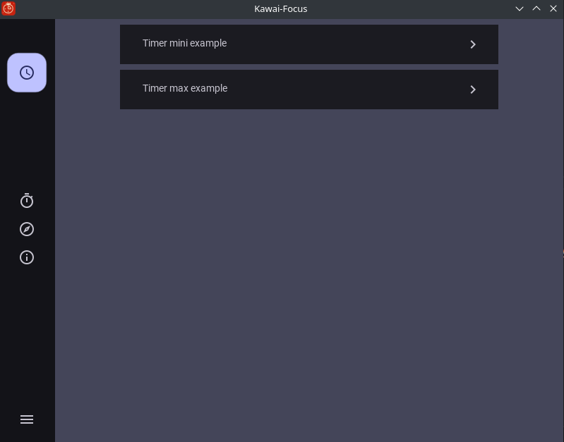
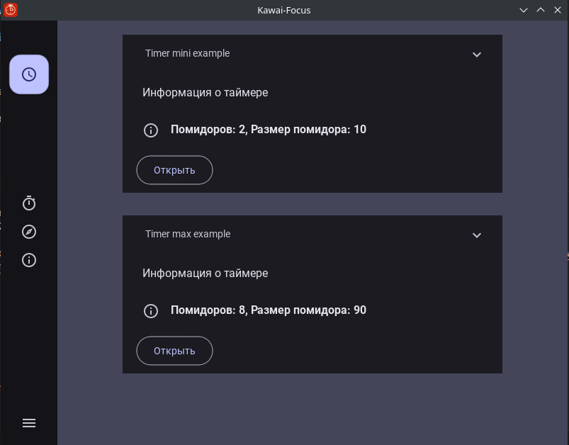
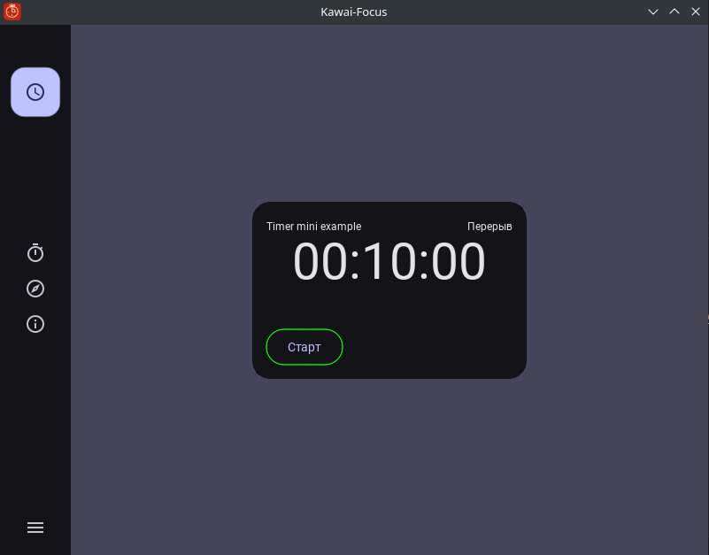
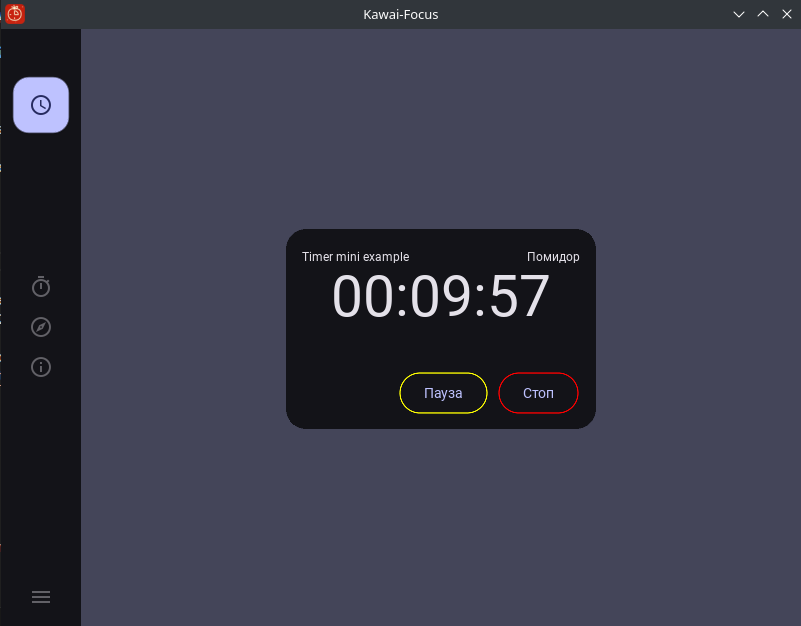
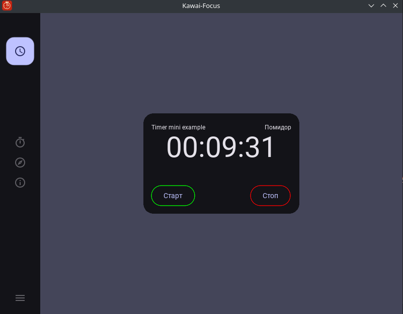
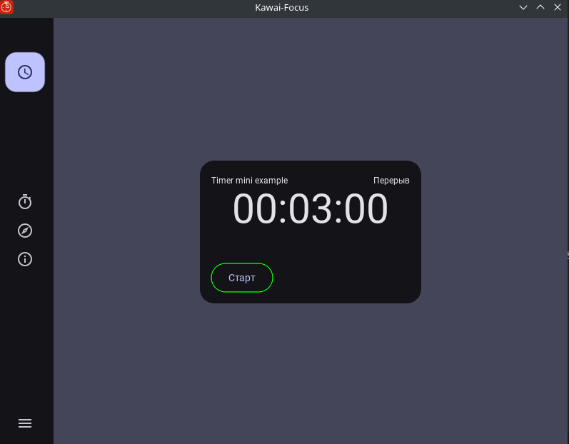
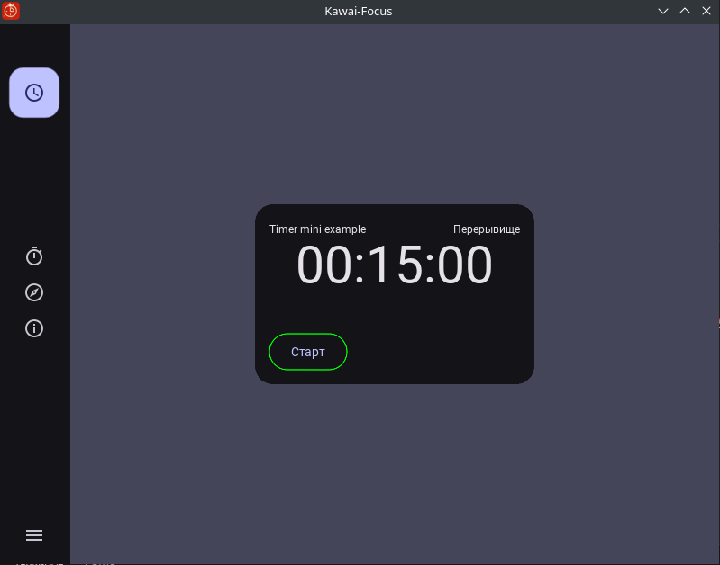
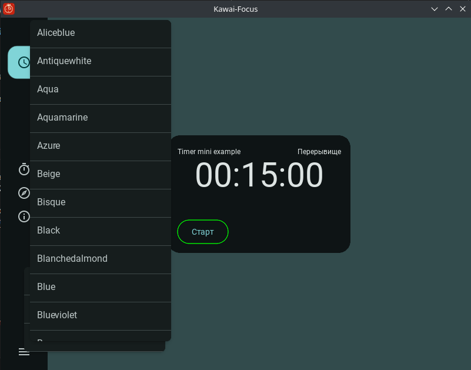
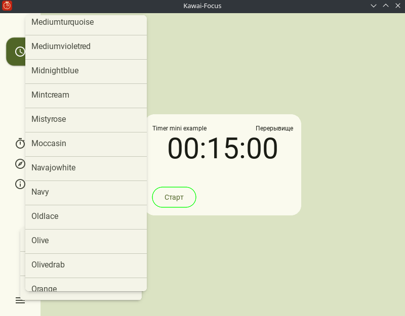
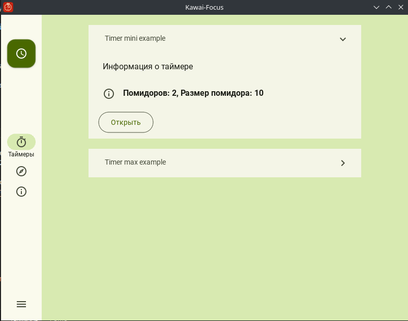

# kawai-focus
Kawai-Focus - приложение для фокусировки внимания на основе таймера Pomodoro.

Проект находится на стадии разработки MVP1:

- **Pomodoro** - таймеры для техники Pomodoro, которая управляет вашим временем работы и перерывами на отдых;
- **Гайд** - информация о том как использовать таймеры и приложение, а так же о самой технике Pomodoro;
- **Ограничение приложений** - управление ограничением работы отвлекающих от работы приложений.

## Стек

- **Python** - язык программирования;
- **Poetry** - инструмент для управления зависимостями и виртуальными окружениями;
- **Kivy** - фреймворк для создания кроссплатформенных приложений;
- **Форк KivyMD 2.0.0** - Material Design на Kivy.

## Экраны

**Экран Таймеры:**

**Экран Таймер:**

**Экран Конструктор таймеров:**

В данный момент отключен, провобится работа по изменению дизана!

**Смена тем (примеры):**

## Запуск

**Разработка dev (Linux):**

`poetry install && alembic upgrade head && poetry run filling_example_timers`  

`poetry run kawai-focus`

**Linux:**

На данный момент ведутся работы над сборкой flathub пакета для Linux!

**Windows:**

В планах собрать установщик!

**Mac OS:**

В планах собрать установщик!

## Автор

**Разработчик проекта:**

- **Имя и Фамилия** - Евгений Каддо
- **Никнейм** - Arduinum628

Подробно рассказываю о процессе написания кода приложения в своих статьях <a href="https://pressanybutton.ru/category/kawai-focus/">kawai-focus</a> на сайте <a href="https://pressanybutton.ru">Код на салфетке</a>.

  

    <strong>
      Как оформлять ветки и коммиты
    </strong>
  

Пример ветки `nickname/name_task`

- **nickname** (никнейм в github);
- **name_task** (название задачи - название карточки на yougile).

Пример коммита `refactor: renaming a variable`

- **feat:** (новая функционал кода, БЕЗ учёта функционала для сборок);
- **devops:** (функционал для сборки, - добавление, удаление и исправление);
- **fix:** (исправление ошибок функционального кода);
- **docs:** (изменения в документации);
- **style:** (форматирование, отсутствующие точки с запятой и т.п., без изменения производственного кода);
- **refactor:** (рефакторинг производственного кода, например, переименование переменной);
- **test:** (добавление недостающих тестов, рефакторинг тестов; без изменения производственного кода);
- **chore:** (обновление рутинных задач и т. д.; без изменения производственного кода). 

Оформление основано на https://www.conventionalcommits.org/en/v1.0.0/

